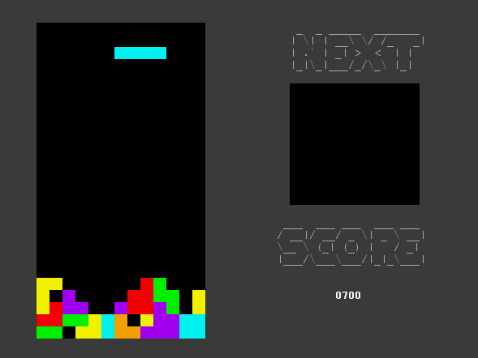
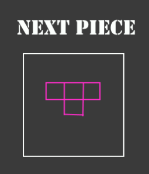
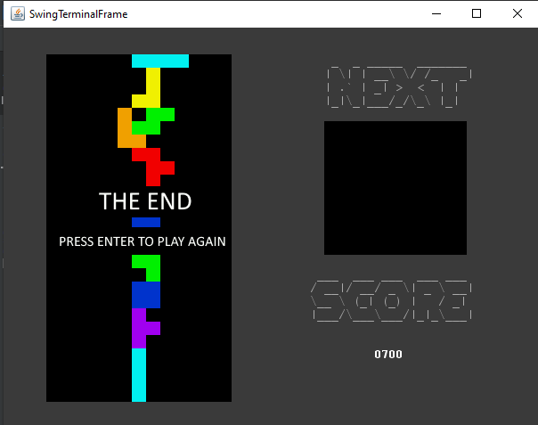

# LPOO_1305 - Tetris

## Game Description

In this implementation of the world known phenomenon game called Tetris, you can feel the nostalgia of putting together all the pieces to survive as long as possible to have the highest score!

This project was developed by *Diogo Costa* (*up202007770*),  *José Costa* (*up202004823*) and *Manuel Amorim* (*up202007485*) for LDTS 2021/22.

## Screenshots

The following media demonstrates our game and what we are turning it into.

### Game Current State

  

  <b><i>Gif 1. Current Game Functionality</i></b>

### Future Functionalities

  

  <b><i>Fig 1. Next piece preview mockup </i></b>

  

  

  <b><i>Fig 2. Score feature mockup </i></b>

  

  

  <b><i>Fig 9. Losing Screen Mockup Preview</i></b>

