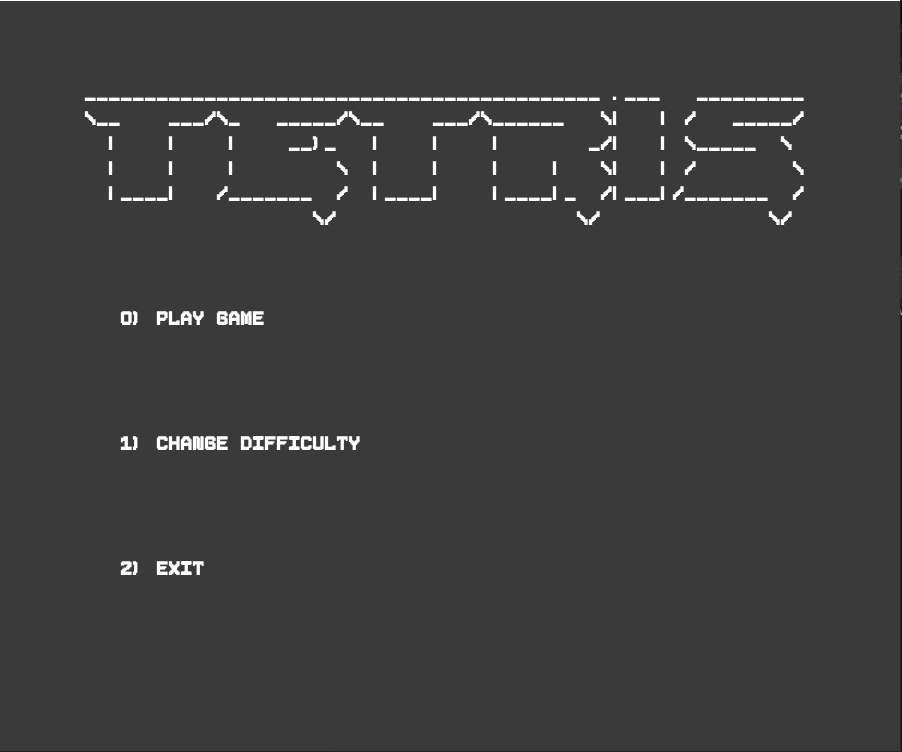
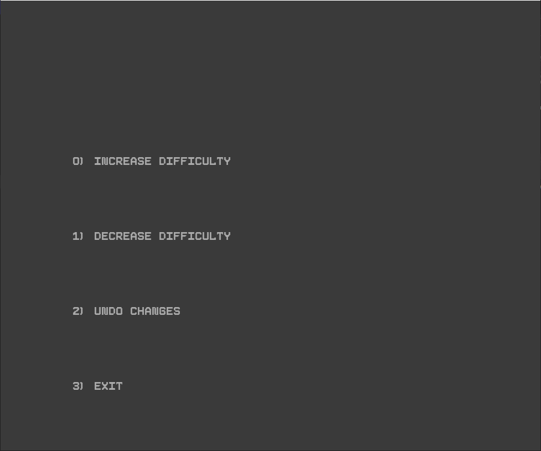
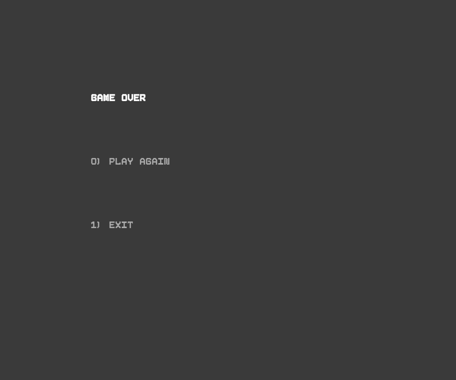

# LPOO_1305 - Tetris

## Game Description

In this implementation of the world known phenomenon game called Tetris, you can feel the nostalgia of putting together all the pieces to survive as long as possible to have the highest score!

This project was developed by *Diogo Costa* (*up202007770*),  *José Costa* (*up202004823*) and *Manuel Amorim* (*up202007485*) for LDTS 2021/22.

## Multimedia

### Game Current State

**Main Menu**

**Instructions Menu**

**Game Over Screen**

