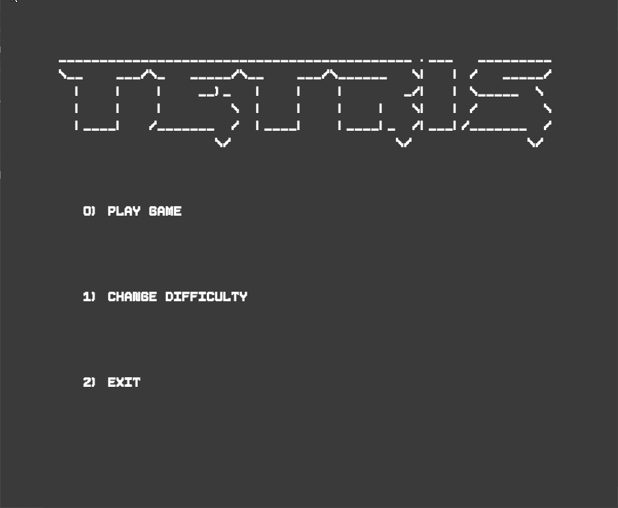

## LPOO_1305 - Tetris

In this implementation of the world known phenomenon game called Tetris, you can feel the nostalgia of putting together all the pieces to survive as long as possible to have the highest score!

This project was developed by *Diogo Costa* (*up202007770*),  *José Costa* (*up202004823*) and *Manuel Amorim* (*up202007485*) for LDTS 2021/22.

### IMPLEMENTED FEATURES

- **Piece Generation -** A piece chosen by random is placed on the game as the previous controlled piece piece is placed.

- **Piece Rotation -** A piece can be rotated by pressing the up arrow.

- **Piece's Movement -** The Player can move the pieces horizontally, in order to line them up according to the player's strategy, he can also force the pieces down, as in the original tetris, to speed up the gameplay.

- **Piece's Collision Detection -** The game will detect if the Player tries to move, or rotate, the piece into an obstacle and **prevent it**. This happens when moving horizontally either into a wall or into another piece. 

  The piece is also **locked** into the board if it's bottom collides either with the floor or into another piece.

- **Game Timing** - synchronized ticks determine the game pace, when the tick counter reaches a predetermined value, *gameSpeed*, the piece drops by one position.
- **Game Over** - The game will detect when the player loses the game, in other words when the static pieces reach the top of the board. In this moment a new screen appears asking if the player wants to play again or exit.
- **Difficulty Controls** - The game allows difficulty changes during the gameplay, as well as an option to undo previous alterations.

### DESIGN

#### Refactoring the project to follow the mvc architectural pattern

**Problem in Context**

While initially working on the project, we were finding ourselves struggling to effectively work on the project all at the same time. On top of that, the complexity level was also rising and making our efforts less productive.

**The Pattern**

The **Model View Controller** (MVC) architectural pattern specifies that an application consist of a data model, information information, and information control. The pattern requires that each of these be separated into different objects.

**Implementation**

The following image represents the different folders that were added to hold the function-specific classes.

**Consequences**

The use of the State Pattern in the current design has the following consequences:

- **Easier planning** by giving us an outline of how to arrange their ideas into actual code and **easier maintenance** by limiting code duplication
- **Easier modification** of the entire application as any changes in a certain section will never affect the entire architecture
- Allows for **easier collaboration** between the team members
- **Supports and encourages TTD** (test-driven development)
- Required us to sometimes split what was previously **one class's functionality into 3 separate classes**, introducing dozens of classes and therefore some complexion

- Required a **heavy refactoring** of all the project's code

------

#### Piece State

**Problem in Context**

In our game, the piece controlled by the player can have different shapes or colors. Instead of hard coding the shape and color into all the classes and duplicating the methods for each class we decided to use the State design pattern.

**The Pattern**

State design pattern is used when an Object changes its behavior based on its internal state.

If we have to change behavior of an object based on its state, we can have a **state variable** in the Object and use if-else condition block to perform different actions based on the state. State pattern is used to provide a systematic and lose-coupled way to achieve this through Context and State implementations.

- **Context:** Defines an interface to client to interact. It maintains references to concrete state object which may be used to define current state of object.
- **State:** Defines interface for declaring what each concrete state should do.
- **ConcreteState:** Provides implementation for methods defined in State.

**Implementation**

The following UML representation shows how the different classes connect themselves. An interface forces the state classes to implement the methods needed to be a state object for the piece Class. If the random algorithm chooses a certain class, for example Lpiece, an instance of this class will be stored as state on the Piece instance that represents the moving piece in the game and the rest of the program will be able to access this state's specific attributes.

**Consequences**

The use of the State Pattern in the current design has the following consequences:

- **Decluttering of the Piece class -**  extracts all state-specific code into a set of distinct classes

- **Implementation implicit code -** The structure of the pattern is implicit in the filesystem, allowing for a better understanding of all of it's functionality

------

#### Implementing difficulty changes using the Command pattern

**Problem in Context**

In our game, the player can access a menu in which he is able to change the difficulty during gameplay. In this menu, the player
is also allowed to undo previous changes he made. Following this thematic, the use of the Command pattern allows the program to 
associate different difficulty changing commands to their respective "undo" command, as well as processing different commands in
an orderly manner.

**The Pattern**

The Command pattern is a behavioral pattern that transforms a request into an isolated object containing all information about
the request. This is important because of the need to queue, specify and execute different orders at different times. This implementation is possible through the creation of an interface **Command**, of which derive the **Concrete Command** objects, that we encapsulate in a **Receiver**, from here we process the **Commands** through an **Invoker**.

- **Command:** Defines an interface for the orders we aim to implement.
- **Concrete Command:** Provides the implementations for the methods defined in Command.
- **Receiver:** Serves as a recipient for the units/queues of Commands.
- **Invoker:** Processes the Commands present in the adequate Receiver.

**Implementation**

The following UML representation shows how the objects that compose the pattern connect themselves:

**Consequences**

The use of the Command Pattern in the current design has the following consequences:

- **Increases code extensibility:** Makes it easier to add further commands without changing existing code and functionality.
- **Reduces the dependency between the invoker and the receiver of a command**.

------

### KNOWN CODE SMELLS AND REFACTORING SUGGESTIONS

#### Missing Overrides

In some instances of the code (e.g. Board.java:117:), the **@Override** method isn't implemented. This can lead to future problems, in the case that we misspell a method of the class, or we don't correctly match the parameters of the two methods, the one in the parent class, and the one in the child class.

A way to overcome future problems is to add the **@Override** method, this because it will not only add a vibrant visual indication of the methods we want to override, but also save the project from future complications.

------

#### Usage of reference equality over value equality:

In this project especially, the vast use of comparisons is necessary for the functionalities implemented over the board and pieces. The comparisons used over each block (represented by a _string_) of the 2D matrices are value comparisons.

A method of overcoming future problems is to use reference equality, as it only needs to check if the two variables hold the same memory address, as oposed to comparing two values, which can be a lot slower.

------

#### Switch Statements

The dispatchKey method in the keyController class is composed of a huge switch statement. Even though in this particular situation it doesn't appear as a big problem, the functionalities implemented in each case are simple, it can still lead to complications.

A way of solving this problem might come from the implementation of a State/Strategy pattern.

### TESTING

- **Coverage Report:**
Class: 85%
Method: 66%
Line: 46%

### GAME DEMO

